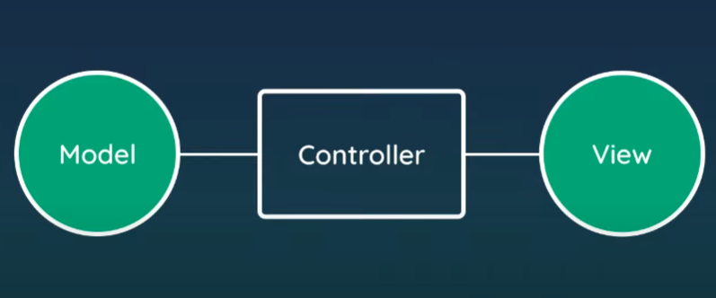

Express Router = this router comes with express and is used to manage and store project routes more efficiently.
-- we often group routes that belong together to maintain a large codebase so that it is easy to read and update

*****************************************************************************************************

### MVC Approach

This approach is a software design pattern that separates an application into three interconnected components: the Model, View, and Controller.

MVC stands for Model, View and Cotroller

Model - The Model represents the data and business logic of the application. It encapsulates the data and provides methods for manipulating and retrieving it. The Model is responsible for managing the data and ensuring its integrity.

View - The View is responsible for rendering the user interface and displaying the data provided by the Model. It receives input from the user and sends it to the Controller for processing. The View is responsible for displaying the data to the user and updating the user interface accordingly.

Controller - The Controller acts as an intermediary between the Model and View. It receives input from the user through the View and sends it to the Model for processing. The Controller then takes the output from the Model and sends it to the View to be displayed to the user. The Controller is responsible for controlling the flow of data and logic between the Model and View.

The MVC pattern provides several benefits, including:

* Separation of Concerns: Each component has a specific responsibility, making it easier to maintain and update the application.
* Reusability: Components can be reused in other applications or projects.
* Flexibility: The MVC pattern allows for easy modification and extension of the application.
* Scalability: The MVC pattern makes it easier to add new features and functionality to the application.

