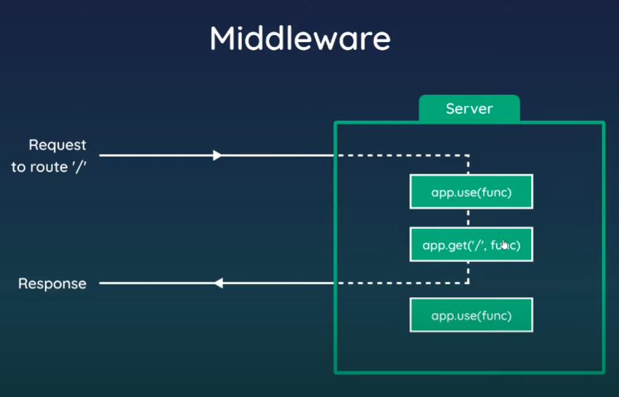

middleware is any code that tuns on the server before sending the response back to browser.

middleware is also used to make static files visible to the browser like static css stylesheet files

we will demo this in next lesson.