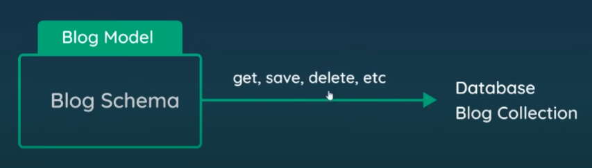

Creating and Testing Mongodb atlas cloud version - https://www.mongodb.com/cloud/atlas/register

Created a db user, a cluster and a db with a collection names blogs.

learned how to connect with connection strings.

---

# Schemas and Models

A db schema defines the structure or the types of data/document , sets the properties and property types

example :
Blog Schema

- title (string), requried
- snippet (string), requried
- body(string ), requried

// above will be the structure of the documents stored inside of our database

*********
Models - A db model allows us to communicate with the database collections.

A model which is created off of a db schema consists of both static and instance methods which will help us to save, delete, update and get data from db.

# use mongeese to connect to db 
pip install mongoose